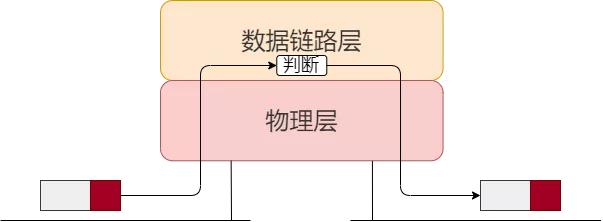
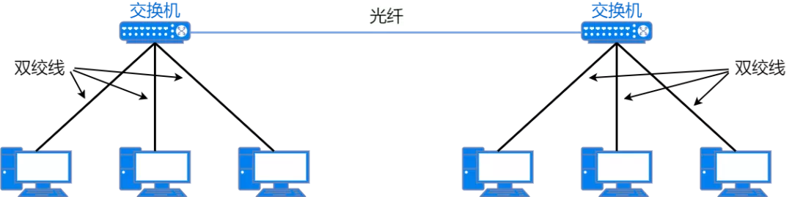
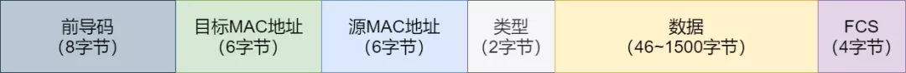

# 网络

## 2层 - 数据链路层

数据链路层设备有二层交换机、网桥等。二层网络设备**只转发数据**，通过识别数据的 **MAC 地址**进行转发。二层交换机接收数据后，对数据最外层封装的以太网头部信息进行查看，看到数据的目的 MAC 地址后，把数据帧从对应端口发送出去。交换机并不会对数据帧进行解封装，只要知道 MAC 地址信息就可以正确地将数据转发出去。

数据链路层处理流程

## 3层 - 网络层

网络层设备有路由器、三层交换机等。三层网络设备**只转发数据**，通过识别数据的 **IP 地址**进行转发。路由器接收数据后，首先查看最外层封装的以太网头部信息，当目的 MAC 地址是自己时，就会将以太网头部解封装，查看数据的 IP 地址。根据 IP 路由表做出转发决定时，路由器会把下一跳设备的 MAC 地址作为以太网头部的目的 MAC 地址，重新封装以太网头部并将数据转发出去。

网络层处理流程

## MAC地址

每个网卡或三层网口都有一个 **MAC 地址**， MAC 地址是烧录到硬件上，因此也称为**硬件地址**。MAC 地址作为数据链路设备的地址标识符，需要保证网络中的每个 MAC 地址都是**唯一**的，才能正确识别到数据链路上的设备。

MAC 地址由 **6** 个字节组成。前 3 个字节表示**厂商识别码**，每个网卡厂商都有特定唯一的识别数字。后 3 个字节由厂商给每个网卡进行分配。厂商可以保证生产出来的网卡不会有相同 MAC 地址的网卡。

## 以太网

以太网

### 网络拓扑

网络的连接和构成的形态称为**网络拓扑**。它不仅可以直观的看到网络物理连接方式，还可以表示网络的逻辑结构。

#### 以太网数据格式

当今最常用的以太网协议标准是 `ETHERNET II` 标准。`ETHERNET II` 标准定义的数据帧格式如下图。

以太网帧格式

### 交换机二层转发原理

交换机有多个网络端口，它通过识别数据帧的**目标 MAC 地址**，根据 **MAC 地址表**决定从哪个端口发送数据。MAC 地址表不需要在交换机上手工设置，而是可以自动生成的。

> 交换机是如何添加、更新、删除 MAC 地址表条目的？

> 如何使用 MAC 地址表条目进行转发？

> 如何使用 MAC 地址表条目进行转发？

**单播**：主机一对一的发送数据。单播地址是主机的 MAC 地址。
**广播**：向局域网内所有设备发送数据。只有全 1 的 MAC 地址为广播 MAC 地址，即 `FF-FF-FF-FF-FF-FF` 。
**泛洪**：将某个端口收到的数据从除该端口之外的所有端口发送出去。泛洪操作广播的是普通数据帧而不是广播帧。

### VLAN

**广播域**是广播帧可以到达的区域。换句话说，由多个交换机和主机组成的网络就是一个广播域。

为了解决广播域扩大带来的性能问题和安全性降低问题， VLAN 技术应运而生。

VLAN 技术能够在逻辑上把一个物理局域网**分隔**为多个广播域，每个广播域称为一个**虚拟局域网**（即 VLAN ）。

每台主机只能属于一个 VLAN ，同属一个 VLAN 的主机通过**二层**直接通信，属于不同 VLAN 的主机只能通过 **IP 路由**功能才能实现通信。

通过划分多个 VLAN ，从而减小广播域传播的范围，过滤多余的包，提高网络的传输效率，同时提高了网络的安全性。

#### VLAN 原理

VLAN 技术通过给数据帧插入 **VLAN 标签**（又叫 `VLAN TAG`）的方式，让交换机能够分辨出各个数据帧所属的 VLAN 。

VLAN 标签是用来区分数据帧所属 VLAN 的，是 4 个字节长度的字段，插入到以太网帧头部上。VLAN 标签会插入到源 MAC 地址后面， **IEEE 802.1Q** 标准有这个格式定义和字段构成说明。

VLAN TAG

> 划分 VLAN 后，交换机如何处理广播报文？

交换机上划分了多个 VLAN 时，在交换机接收到广播数据帧时，只会将这个数据帧在相同 VLAN 的端口进行**广播**。

> 划分 VLAN 后，交换机如何处理目的 MAC 地址不在 MAC 地址表中的单播数据帧？

交换机上划分了多个 VLAN 时，当交换机接收到一个目的 MAC 地址不存在于自己 MAC 地址表中的单播数据帧时，只会将这个数据帧在相同 VLAN 的端口进行**泛洪**。

> 划分 VLAN 后，不同 VLAN 的主机能否通信？

划分多 VLAN 的环境中，即使交换机 MAC 地址表里保存了某个数据帧的目的 MAC 地址条目，若这个目的 MAC 地址所对应的端口与数据帧的入端口在不同的 VLAN 中，交换机也不会通过 MAC 地址表中的端口发送数据帧。

**小结**：在不使用路由转发的前提下，交换机不会从一个 VLAN 的端口中接收到的数据帧，转发给其它 VLAN 的端口。

> 怎么区分不同的 VLAN ？

通过 VLAN ID 进行区分，例如 VLAN 10 和 VLAN 20 就是不同的 VLAN 。

> VLAN 技术有哪些好处？

- 增加了广播域的数量，减小了每个广播域的规模，也减少了每个广播域中终端设备的数量；
- 增强了网络安全性，保障网络安全的方法增加了；
- 提高了网络设计的逻辑性，可以规避地理、物理等因素对于网络设计的限制。

#### 划分 VLAN

### 参考

[37张图详解MAC地址、以太网、二层转发、VLAN](https://mp.weixin.qq.com/s?__biz=Mzg5NDYxNDU2Ng==&mid=2247502982&idx=1&sn=e9055c6bada4ef188aeaeb78808c3791)

