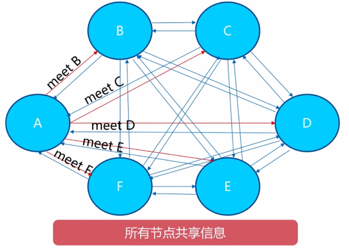
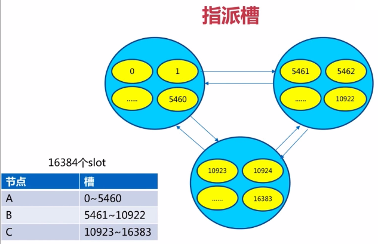
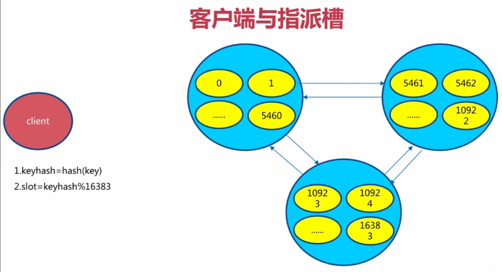

## 一致性哈希 - 扩容

1. 客户端分片：哈希+顺时针(优化取余)
2. 节点伸缩：只影响邻近节点，但是还是有数据迁移
3. 翻倍伸缩：保证最小迁移数据和负载均衡

**添加节点前**


**添加节点后**


## 虚拟槽分区（Redis Cluster使用的方式）
1. 槽的范围0~16383

假设有5个节点，平均分

                                key                 RedisCluster
    0~3276      ->  node1       |                   slot-1  -> data
    3277~6553   ->  node2       CRC16(key)%16383    slot-2  -> data
    6554~9830   ->  node3                           slot-3  -> data
    9831~13107  ->  node4                           slot-4  -> data
    13108~16383 ->  node5                           slot-5  -> data

客户端请求流程：
1. Redis每个节点node都是共享消息的，每个节点都知道自己的槽范围，以及其他槽的范围
2. 客户端随机取一个节点，使用key去查询
3. 节点对key做算法，CRC16(key)%16383
4. 算出来的值，如果在节点的槽的范围，则直接返回值结果
5. 如果不在槽的范围，则返回客户端应该去从哪一个节点取数据

缺点：  
命中准确的概率较小，客户端做优化，能精确的命中节点

## Redis Cluster的集群架构

#### 单机架构
    
             Redis
        /      |     \
    client  client  client

#### Redis Cluster


1. 节点：每个节点都可以读写
2. meet：节点之间的相互通信

3. 指派槽：给每一个节点指派槽


4. 复制：每一个主节点都有从节点

#### 启动集群
配置：  
cluster-enables: yes

#### Redis Cluster 特性
1. 主从复制：每个主节点，都有一个从节点
2. 高可用
3. 分片

#### 原生命令安装
1. 配置开启节点  
    **Redis配置文件**
    ```text
    port ${port}
    daemonize yes
    dir "/opt/soft/redis/data"
    dbfilename "dump-${port}.rdb"
    logfile "${port}.log"
    
    ##节点配置##
    #集群开启标识
    cluster-enabled yes
    #节点超时时间，故障转移时间
    cluster-node-timeout 15000
    #集群本地配置文件，里面有节点的node-id，这个配置由集群自动维护
    cluster-config-file nodes-${port}.conf
    #集群中所有节点都提供服务，才认为集群可用的，否则不提供服务
    cluster-require-full-coverage no
    ```
2. 节点启动
    ```text
    redis-server redis-7000.conf
    redis-server redis-7001.conf
    redis-server redis-7002.conf
    redis-server redis-7003.conf
    redis-server redis-7004.conf
    redis-server redis-7005.conf
    ```
3. meet
    ```text
    #命令
    cluster meet ip port
 
    #示例
    redis-cli -h 127.0.0.1 -p 7000 cluster meet 127.0.0.1 7001
    redis-cli -h 127.0.0.1 -p 7000 cluster meet 127.0.0.1 7002
    redis-cli -h 127.0.0.1 -p 7000 cluster meet 127.0.0.1 7003
    redis-cli -h 127.0.0.1 -p 7000 cluster meet 127.0.0.1 7004
    redis-cli -h 127.0.0.1 -p 7000 cluster meet 127.0.0.1 7005
    ```
4. 指派槽
    
    **命令**
    ```text
    cluster addslots slot[slot...]
 
    #例如
    redis-cli -h 127.0.0.1 -p 7000 cluster addslots {0...5461}
    redis-cli -h 127.0.0.1 -p 7001 cluster addslots {5462...10922}
    redis-cli -h 127.0.0.1 -p 7002 cluster addslots {10923...16383}
    
    #给7000节点分配 0 号槽
    redis-cli -h 127.0.0.1 -p 7000 cluster addslots 0
    ```
    
    **脚本**
    ```text
    #为了更加方便的分配槽写一个shell -- vim addslots.sh
    start=$1
    end=$2
    port=$3
    for slot in `seq ${start} ${end}`
    do
       echo "slot: ${slot}"
       redis-cli -p ${port} cluster addslots ${slot}
    done

    #执行 addslots.sh 即可给7000节点添加101个槽
    sh addslots.sh 0 100 7000
    ```
    
    **示例**
    ```text
    #依此给7001 7002 添加槽
    sh addslots.sh 5462 10922
    sh addslots.sh 10923 16383
    ```
5. 主从关系设置
    ```text
    #命令
    cluster replicate node-id
 
    #node-id获取
    #node-id从集群自己的配置文件查看node-${port}.conf
   
    ##集群命令#
    #集群整体信息，也可以查看node-id，其输出结果与配置文件相同
    redis-cli -h 127.0.0.1 -p 7000 cluster nodes
    #集群节点信息
    redis-cli -h 127.0.0.1 -p 7000 cluster info
    #集群槽的信息
    redis-cli -h 127.0.0.1 -p 7000 cluster slots
    #集群模式客户端，-c集群模式客户端访问
    redis-cli -c -p 7000
    ```

    **示例**
    ```text
    #查看集群信息，一行中第一个为node-id
    redis-cli -h 127.0.0.1 -p 7000 cluster nodes
    
    #设置7003为7000节点的slave、7004为7001节点的slave、7005为7002节点的slave
    redis-cli -h 127.0.0.1 -p 7003 cluster replicate ${node-id-7000}
    redis-cli -h 127.0.0.1 -p 7004 cluster replicate ${node-id-7001}
    redis-cli -h 127.0.0.1 -p 7005 cluster replicate ${node-id-7002}
    ```

## ruby安装(官方工具，推荐)
1. 高效、准确
2. 生产环境可以使用
3. 支持伸缩
4. 支持三方可视化界面安装


* [Redis Cluster 原生命令搭建](https://www.cnblogs.com/outxiao/p/12985688.html)
